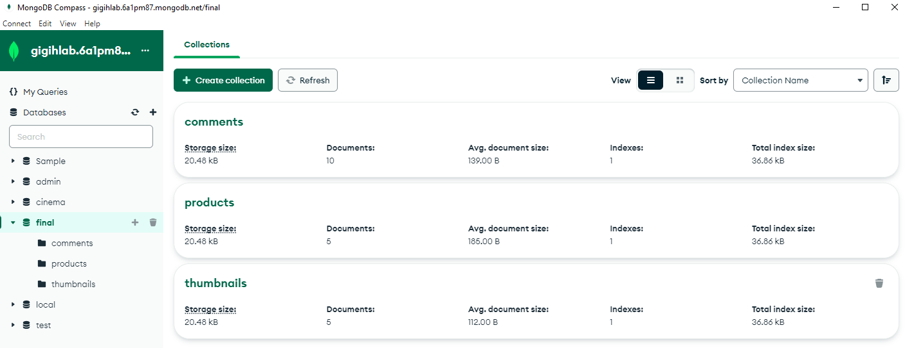

# Final Project Back-end side

Edited from previous Mid-Term project for the same program [Mid-Term-Link-Here](https://github.com/alanluthfi/Mid-Term-gigih-3.0)

## Hosted back-end url

[https://final-back-end.vercel.app](https://final-back-end.vercel.app)/{route}

## DataBase structure

Using database named "gigih-lab", in "final" collection which containing comments, products, and thumbnails to save the respective data.


## API structure

- using express router to access the respective data for each document collection
- thumbnail router standalone
- product route must be using videoID from thumbnail to get the return of data from respective thumbnail videoID
- comment route must be using videoID from thumbnail to get the return of data from respective thumbnail videoID

## List API request and response

can be viewed in [List-Api-Req-Res-File](ListAPIRequestandResponse.md)

# How to run in local

## used module:

```
    "body-parser": "^1.20.2",
    "cors": "^2.8.5",
    "dotenv": "^16.3.1",
    "express": "^4.18.2",
    "mongoose": "^7.4.0",
    "nodemon": "^3.0.1",
```

## Set up the MongoDB connection:

- Make sure you have MongoDB installed and running on your local machine.
- Copy .env.example to .env

  ```
  cp .env.example .env
  ```

- In the `.env` file, update the MongoDB connection string to point to your local MongoDB instance.

## start the server with:

in root project folder terminal using `npm start`

**Post to thumbnail DataBase using postman:**

`POST http://localhost:3069/thumb/create`
with json body:

```
{
    "videoID": "0",
    "UrlThumb":"YoutubeEmbedUrl"
}
```

**Get thumbnail data**

`GET http://localhost:3069/thumb/getThumb`

**Post to product DataBase using postman:**

`POST http://localhost:3069/product/create`
with json body:

```
{
    "productID":"0",
    "productLink":"ProductUrl",
    "title":"product title",
    "price": 10000
}
```

**Get product data**

`GET http://localhost:3069/product/YoutubeVideoID`

**Post to comment DataBase using postman:**

`POST http://localhost:3069/comment/create`
with json body:

```
{
    "userName":"Name",
    "comment":"comment fill",
    "videoID":"YoutubeVideoID"
}
```

**Get comment data**

`GET http://localhost:3069/comment/YoutubeVideoID`
